# WorkOrderWizard
A system for tracking work orders and billing for all of your customers.

## What is it?
WOW is a system for tracking work orders / invoices, by customer. The app will be available to users under the Freemium model. Users will sign up for a account and will be able to log into a central site to manage and track all expenses and receipts for work done for their customers. It will support creating and exporting work orders and invoices. If users so choose they can also track their suppliers and material expenses in the system as well as their invoices, which enables them to calculate the entire cost basis for a given customer or work order, which can be useful for purposes of tax preparation.

## Tech Stack
MERN (MongoDB, Express, React, and Node)

Built for the desktop experience as well as native mobile. React Native will be used to create iOS and Android smartphone apps.

Depending on our needs during the development process, we may choose to employ Reduct or Context API in order to track application state.

## Installation
In addition to running npm install in both the root directory of the project and the /client directory of the project, you will also need a .env file with the SKIP-PREFLIGHT-CHECK=true, and with the firebase connection details because firebase is used for login.

## Deployment
This will be a cloud-based service. We may choose to utilize an automatically scaling deployment service such as Amazon Elastic Beanstalk.

## Design Documents

### Data Model:
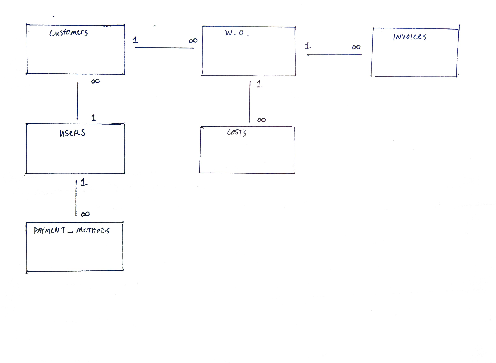

### Landing Page:
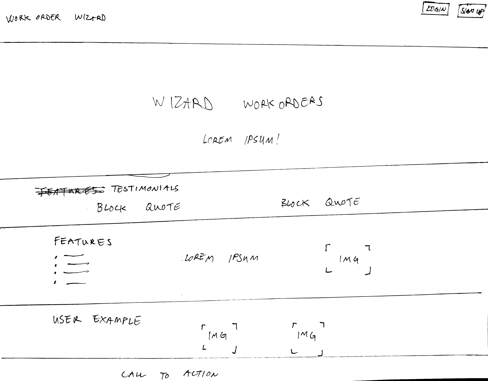

### Login Modal on Landing Page:
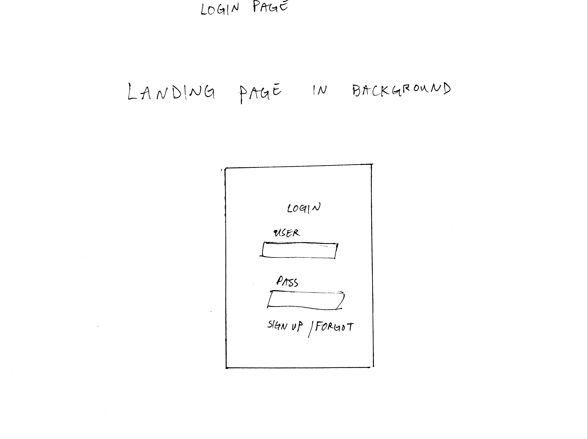

### User's Home Page
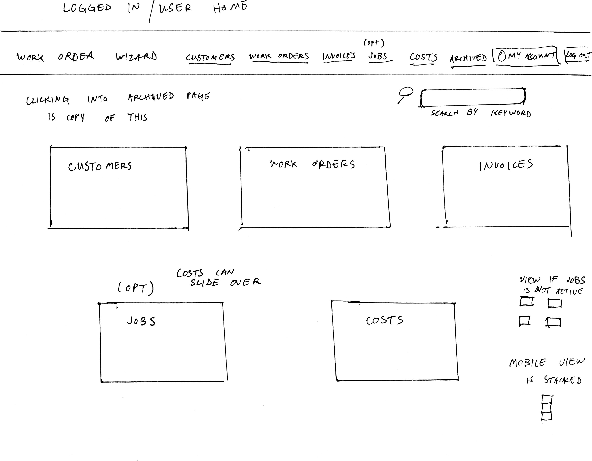

### Customers Page
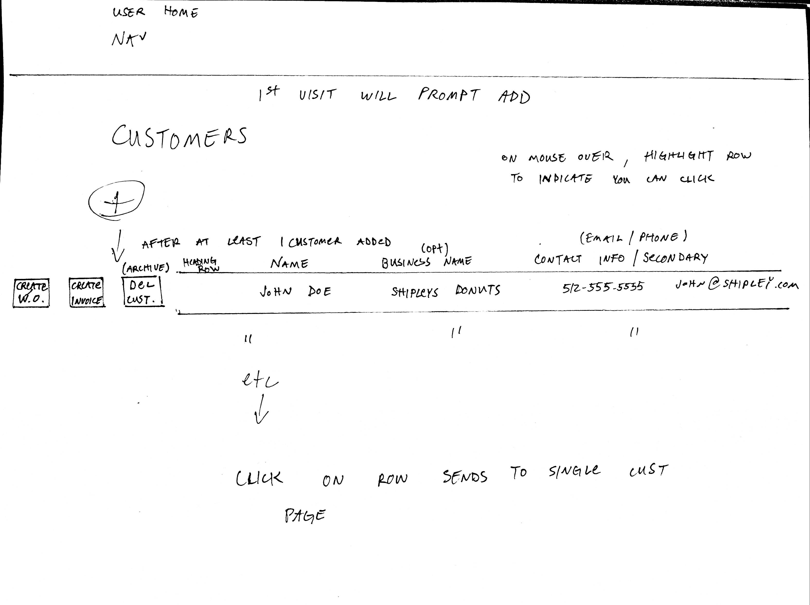

### Single Customer Page
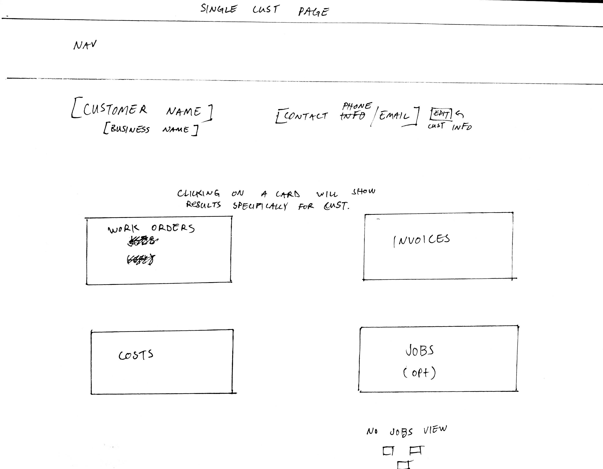

### Work Orders Page
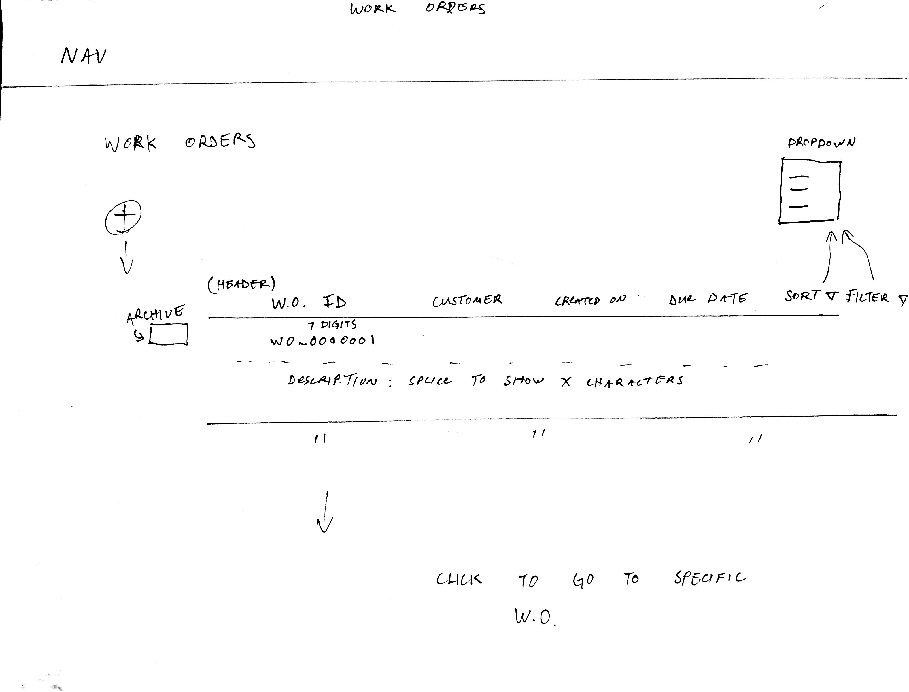

### Single Work Order Page
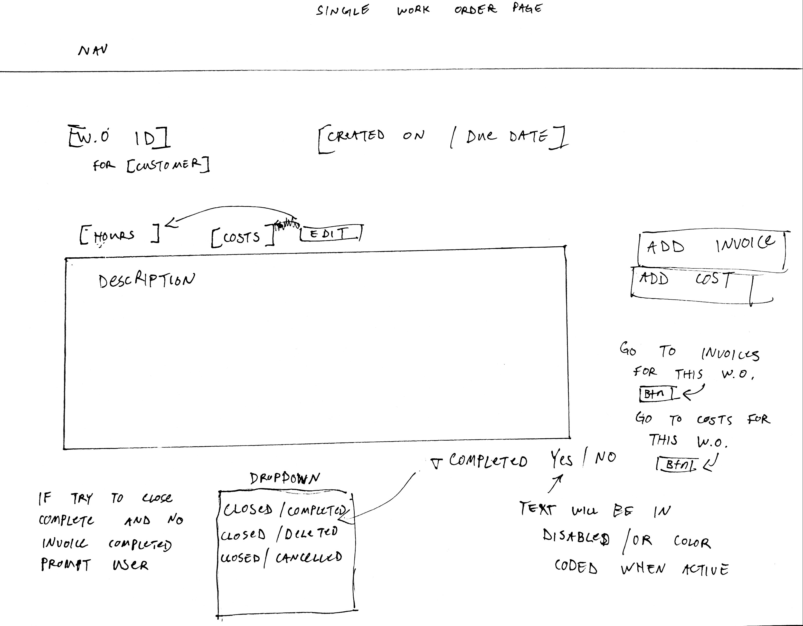

### Invoices Page
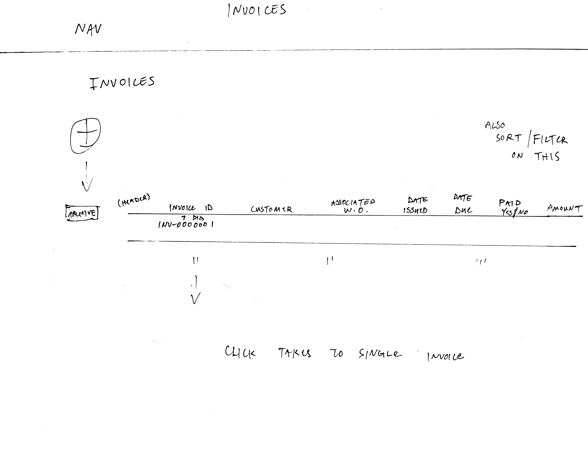

### Single Invoice Page
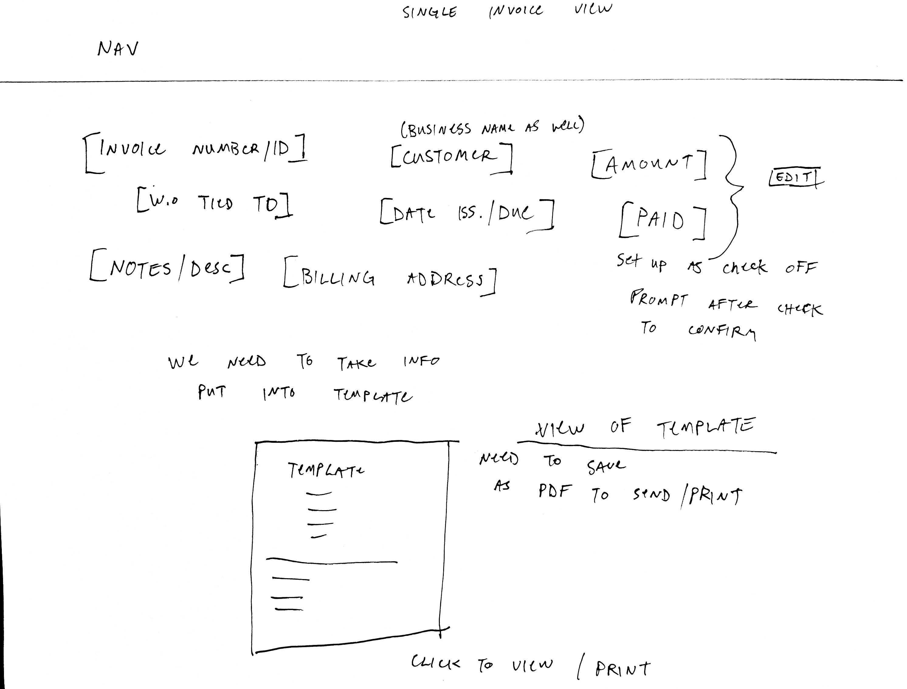

### Costs Page
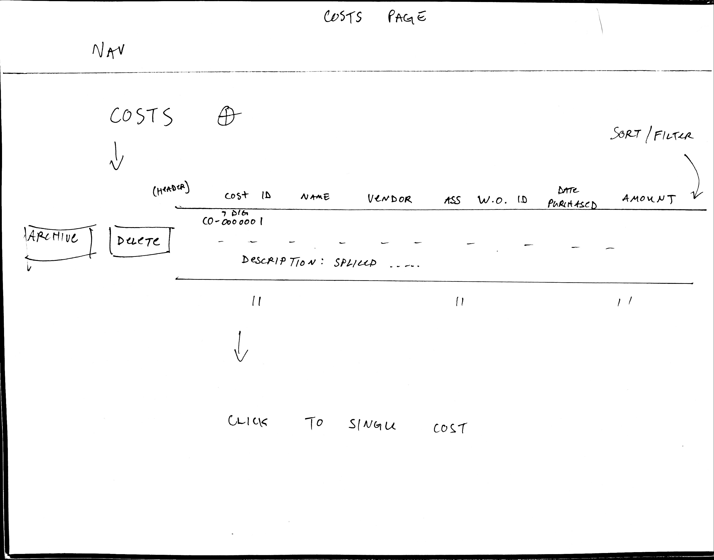

### Single Cost Page
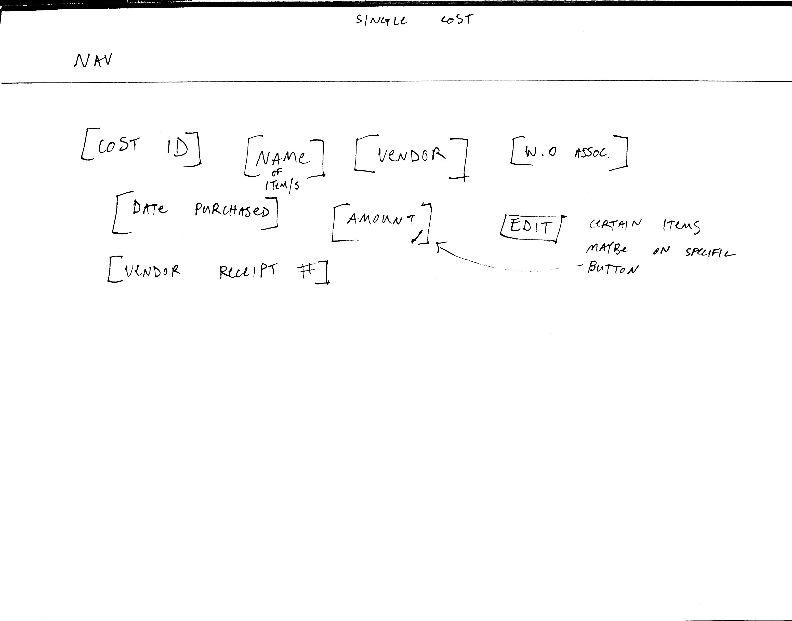

### User Account Management Page
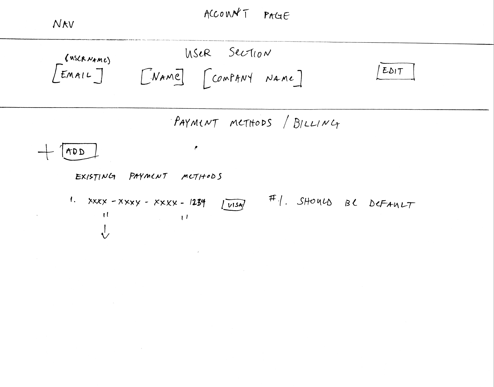

# React README follows:

This project was bootstrapped with [Create React App](https://github.com/facebook/create-react-app).

## Available Scripts

In the project directory, you can run:

### `npm start`

Runs the app in the development mode. 
Open [http://localhost:3000](http://localhost:3000) to view it in the browser.

The page will reload if you make edits. 
You will also see any lint errors in the console.

### `npm test`

Launches the test runner in the interactive watch mode. 
See the section about [running tests](https://facebook.github.io/create-react-app/docs/running-tests) for more information.

### `npm run build`

Builds the app for production to the `build` folder. 
It correctly bundles React in production mode and optimizes the build for the best performance.

The build is minified and the filenames include the hashes. 
Your app is ready to be deployed!

See the section about [deployment](https://facebook.github.io/create-react-app/docs/deployment) for more information.

### `npm run eject`

**Note: this is a one-way operation. Once you `eject`, you can’t go back!**

If you aren’t satisfied with the build tool and configuration choices, you can `eject` at any time. This command will remove the single build dependency from your project.

Instead, it will copy all the configuration files and the transitive dependencies (Webpack, Babel, ESLint, etc) right into your project so you have full control over them. All of the commands except `eject` will still work, but they will point to the copied scripts so you can tweak them. At this point you’re on your own.

You don’t have to ever use `eject`. The curated feature set is suitable for small and middle deployments, and you shouldn’t feel obligated to use this feature. However we understand that this tool wouldn’t be useful if you couldn’t customize it when you are ready for it.

## Learn More

You can learn more in the [Create React App documentation](https://facebook.github.io/create-react-app/docs/getting-started).

To learn React, check out the [React documentation](https://reactjs.org/).

### Code Splitting

This section has moved here: https://facebook.github.io/create-react-app/docs/code-splitting

### Analyzing the Bundle Size

This section has moved here: https://facebook.github.io/create-react-app/docs/analyzing-the-bundle-size

### Making a Progressive Web App

This section has moved here: https://facebook.github.io/create-react-app/docs/making-a-progressive-web-app

### Advanced Configuration

This section has moved here: https://facebook.github.io/create-react-app/docs/advanced-configuration

### Deployment

This section has moved here: https://facebook.github.io/create-react-app/docs/deployment

### `npm run build` fails to minify

This section has moved here: https://facebook.github.io/create-react-app/docs/troubleshooting#npm-run-build-fails-to-minify
